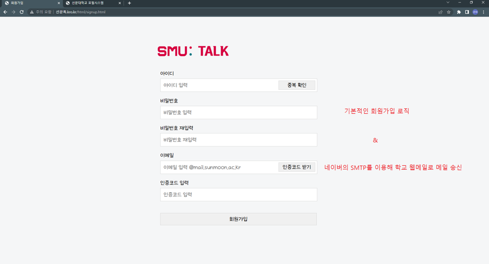
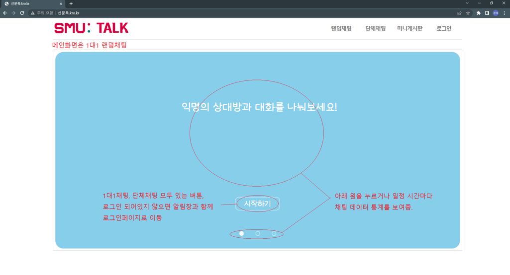
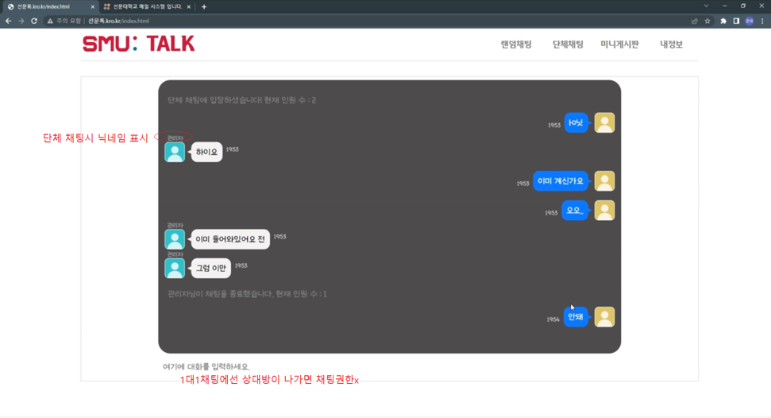
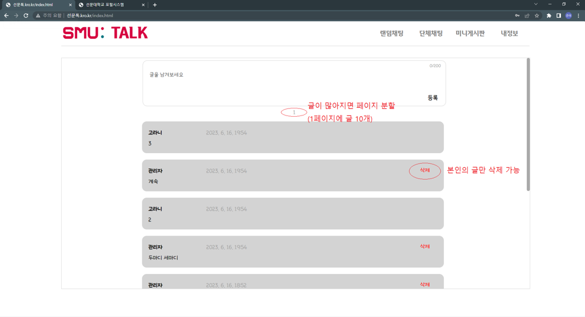
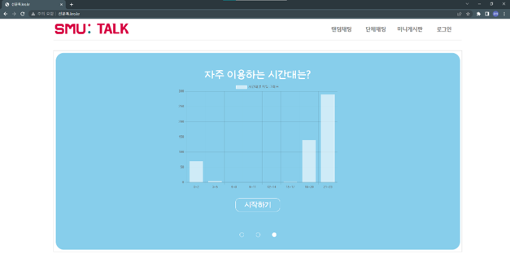
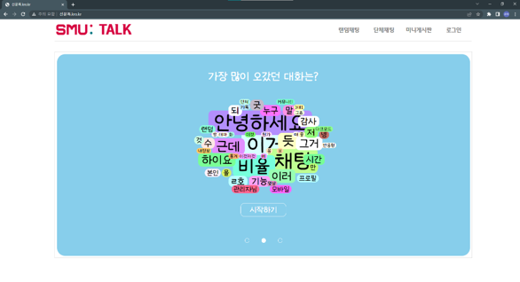

# 랜덤 채팅 웹 애플리케이션 (2023.06)
프로젝트 명: SunmoonTalk

개발 인원: 2명

익명으로 사용자와 랜덤 매칭을 통해 실시간 채팅

## 주요 기능
### 회원관리
- 회원가입 / 로그인
- **이메일** 인증 (이메일로 발송한 인증번호 입력 -> 회원가입 완료)
    
    

### 채팅
- **랜덤 매칭** 1대1 채팅
- **단체** 채팅 
- **욕설 필터링**
    
    
    

### 게시판
- **게시글** 작성 / 업로드
- **댓글**로 소통 가능

    

### 통계 제공
- **시간별** 채팅 이용 유저 분포
- 가장 많이 사용된 단어 **워드클라우드**로 시각화

    
    

## 기술스택
- HTML, CSS, JavaScript
- Node.js, Python
- MariaDB
    
## 소개 영상
- 영상 안 보이면 [여기로](./image)

https://github.com/user-attachments/assets/1616e0cd-1f83-4b6c-97b0-236fee92634d

https://github.com/user-attachments/assets/5fc2980f-91a8-4e9f-9989-af83a76be0c8

https://github.com/user-attachments/assets/8443325c-730a-4808-ad59-e91398905aad

